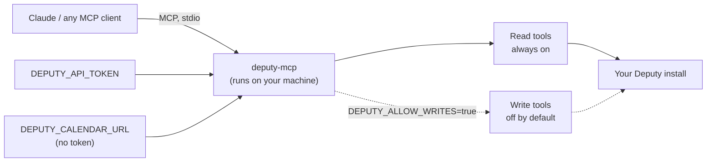

# deputy-mcp

Ask Claude *"what's my next shift?"* or *"who's clocked in right now?"* and get the
answer straight from your [Deputy](https://www.deputy.com) roster — no app, no dashboard.

[](https://github.com/augbastos/deputy-mcp/actions/workflows/ci.yml)
[](LICENSE)
[](https://www.python.org/downloads/)
[](https://modelcontextprotocol.io)
[](#privacy--security)

deputy-mcp connects Deputy — the workforce scheduling and timesheet platform — to
Claude and any other MCP client. If your work life runs through Deputy, this lets you
ask about your own shifts, timesheets, and who's on right now in plain language,
instead of opening the app. It runs on your machine and only ever talks to your own
Deputy install.

---

## Example

> **"When do I work next?"**
> Fri 18 Jul, 09:00–17:00 · Cloud Nine Cafe

> **"Am I clocked in right now?"**
> Yes — since 20:27, still in progress.

> **"Who else is on with me tonight?"**
> Sam O'Brien, rostered until 23:27.

*(Fictional example data — Cloud Nine Cafe and its staff aren't real; see
[`examples/mock_deputy.py`](examples/mock_deputy.py).)*

---

## Installation

Needs [uv](https://docs.astral.sh/uv/) (or anything that can run `uvx`).

**Get a token.** In Deputy: **Business settings → Integrations → API access → New
OAuth Client → Get an Access Token** (shown once — copy it). This needs an admin
access level in Deputy. No admin access? Skip to
[No token? Use your calendar feed](#no-token-use-your-calendar-feed) below.

**Get your base URL.** The address you see in the browser when logged in to Deputy,
e.g. `https://your-company.eu.deputy.com`.

### Claude Code

```bash
claude mcp add deputy \
  -e DEPUTY_API_TOKEN=your-deputy-token \
  -e DEPUTY_BASE_URL=https://your-company.eu.deputy.com \
  -- uvx --from git+https://github.com/augbastos/deputy-mcp deputy-mcp
```

Add `-e DEPUTY_ALLOW_WRITES=true` to also enable the write tools (off by default).

### Claude Desktop

Add to `claude_desktop_config.json`:

```json
{
  "mcpServers": {
    "deputy": {
      "command": "uvx",
      "args": ["--from", "git+https://github.com/augbastos/deputy-mcp", "deputy-mcp"],
      "env": {
        "DEPUTY_API_TOKEN": "your-deputy-token",
        "DEPUTY_BASE_URL": "https://your-company.eu.deputy.com"
      }
    }
  }
}
```

### Any other MCP client

deputy-mcp speaks MCP over stdio. Point your client at
`uvx --from git+https://github.com/augbastos/deputy-mcp deputy-mcp` and set the same
`DEPUTY_*` environment variables (full list in [Configuration](#configuration)).

### No admin access? Use OAuth login

Still not a Deputy admin, but want the full API rather than the read-only iCal
fallback below? Register a personal OAuth app instead:

1. Open <https://once.deputy.com/my/oauth_clients> and create an app.
2. Set its redirect URI to exactly `http://localhost:8823/callback`.
3. Set `DEPUTY_OAUTH_CLIENT_ID` and `DEPUTY_OAUTH_CLIENT_SECRET` from that app.
4. Run `deputy-mcp login` — it opens your browser, you approve, and the resulting
   access/refresh token pair is saved to `~/.deputy-mcp/token.json` (override the
   location with `DEPUTY_TOKEN_STORE`).

This unlocks the same full `/my/*` surface as a static admin token, refreshing the
access token automatically as it expires. Run `deputy-mcp logout` to remove the
stored token.

### No token? Use your calendar feed

Not a Deputy admin? Every employee has a personal iCal feed of their own roster, and
that's enough to run deputy-mcp with no API token. In Deputy, open **My Schedule →
Subscribe / Export to calendar** and copy the link. Set it as `DEPUTY_CALENDAR_URL`
instead of `DEPUTY_API_TOKEN` / `DEPUTY_BASE_URL`.

This mode is read-only and roster-only — `deputy_get_my_roster`, `deputy_next_shift`,
`deputy_whoami`, `deputy_get_my_calendar_url`. The feed link is a secret (it carries
your personal token); never commit it.

---

## Tools

Every tool accepts `response_format` — `"markdown"` (default) or `"json"`. `?` marks
an optional argument.

### Read — always on

Self-service tools work on any employee token. Team/manager tools need an elevated
access level — on a plain employee token they fail with a clear "needs manager/admin
access" message rather than a cryptic error.

| Tool | Arguments | Returns |
|------|-----------|---------|
| `deputy_whoami` | — | Who the token authenticates as, your location and timezone, whether you're clocked in, and your calendar feed URL. Run this first. |
| `deputy_get_my_roster` | `start_date?`, `end_date?` | Your scheduled shifts in a date range (default: today → +7 days). |
| `deputy_next_shift` | `employee?` | Your next upcoming shift. Naming someone else needs manager/admin. |
| `deputy_get_my_timesheets` | `start_date?`, `end_date?` | Your worked timesheets, with a total (default: last 7 days). |
| `deputy_get_my_calendar_url` | — | Your personal iCal feed — add it once to Google/Apple/Outlook Calendar. |
| `deputy_get_areas` | — | Areas (work locations) you work, with ids. |
| `deputy_get_my_colleagues` | `same_workplace_only?` | People you work with, grouped by location — names only, never contact details. |
| `deputy_get_team_roster` *(manager)* | `date?`, `start_date?`, `end_date?`, `area_id?` | Every scheduled shift in a range, optionally scoped to one area. |
| `deputy_who_is_working` *(manager)* | `at?` | Snapshot at an instant (default now): who's clocked in vs rostered. |
| `deputy_get_employee_info` *(manager)* | `name_or_id` | Profile(s) matching a name or id. |
| `deputy_search_shifts` *(manager)* | `employee?`, `area_id?`, `start_date?`, `end_date?`, `open_only?`, `limit?`, `offset?` | Shifts filtered by person, area, date, open status — paginated. |

### Write — opt-in, off by default

This is a deliberate security default, not a limitation: write tools only get
registered when you set `DEPUTY_ALLOW_WRITES=true`. Until then, a model can't see
them, let alone call them. Every write acts as the signed-in token holder; none of
them delete anything.

| Tool | Arguments | Returns |
|------|-----------|---------|
| `deputy_claim_open_shift` | `shift_id` | Assigns you to an open shift. |
| `deputy_request_shift_swap` | `shift_id`, `note?` | Offers one of your shifts for swap, pending manager approval. |
| `deputy_set_unavailability` | `start`, `end`, `reason?`, `repeat?` | Records an unavailability window (one-off or recurring). |
| `deputy_clock_in` | `area_id?` | Starts a live timesheet. |
| `deputy_clock_out` | `mealbreak_minutes?` | Ends your in-progress timesheet. |

---

## How it works



Reads are always registered. Writes only exist as callable tools once you opt in —
otherwise the model can't see them at all.

---

## Privacy & security

Runs locally as a stdio process — no hosted backend, no telemetry. Its only network
traffic is HTTPS to your own Deputy install (or your personal iCal feed); nothing
passes through a third party. deputy-mcp does exactly what your Deputy token can do,
no more — the token is held in memory, redacted from logs, and never printed.

OAuth mode (`deputy-mcp login`) additionally persists the access/refresh token pair
to `~/.deputy-mcp/token.json` (override with `DEPUTY_TOKEN_STORE`), written with
owner-only `0600` permissions where the OS supports them. The login flow itself never
logs or prints the authorization code, access token, refresh token, or client secret —
only progress messages and, on success, the token's expiry; `deputy-mcp logout`
deletes the stored file.

---

## Configuration

All settings are `DEPUTY_*` environment variables. Provide **one** credential set:
`DEPUTY_API_TOKEN` + `DEPUTY_BASE_URL` for the full API, `DEPUTY_OAUTH_CLIENT_ID` +
`DEPUTY_OAUTH_CLIENT_SECRET` (via `deputy-mcp login`) for the same API without an
admin token, or `DEPUTY_CALENDAR_URL` alone for iCal mode. Copy
[`.env.example`](.env.example) to `.env` and fill it in (never commit `.env`).

| Variable | Required | Default | Description |
|----------|----------|---------|-------------|
| `DEPUTY_API_TOKEN` | API mode | — | Deputy permanent or OAuth access token (stored redacted). |
| `DEPUTY_BASE_URL` | API mode | — | Your install origin, e.g. `https://your-company.eu.deputy.com`. |
| `DEPUTY_CALENDAR_URL` | iCal mode | — | Your personal iCal feed URL (token-free, roster-only, stored redacted). |
| `DEPUTY_OAUTH_CLIENT_ID` | OAuth mode | — | Client id of a personal OAuth app registered at once.deputy.com/my/oauth_clients. |
| `DEPUTY_OAUTH_CLIENT_SECRET` | OAuth mode | — | Client secret for the same app (stored redacted, never logged). |
| `DEPUTY_TOKEN_STORE` | No | `~/.deputy-mcp/token.json` | Where `deputy-mcp login` persists the OAuth access/refresh token pair. |
| `DEPUTY_OAUTH_REDIRECT_PORT` | No | `8823` | Loopback port for the `deputy-mcp login` browser callback. |
| `DEPUTY_ALLOW_WRITES` | No | `false` | Enable the write tools. |
| `DEPUTY_ALLOW_CUSTOM_HOST` | No | `false` | Allow a base URL host outside `*.deputy.com` (enterprise custom domains). |
| `DEPUTY_CACHE_TTL` | No | `30` | In-memory read-cache lifetime, seconds. `0` disables caching. |
| `DEPUTY_TIMEOUT` | No | `30` | Per-request HTTP timeout, seconds. |
| `DEPUTY_MAX_RETRIES` | No | `3` | Automatic retries on `429`/`5xx` (with backoff). |
| `DEPUTY_ENV_FILE` | No | — | Path to a dotenv file to load `DEPUTY_*` values from. |

---

## CLI (bonus)

The same client ships as a small standalone CLI, for a quick check without an MCP
client:

```bash
deputy-mcp whoami     # who you're authenticated as
deputy-mcp roster     # your roster (--team for everyone, --area ID to scope)
deputy-mcp who        # who's working right now
deputy-mcp next       # your next shift
```

Add `--json` for raw output. With no subcommand, `deputy-mcp` starts the MCP server.

---

## Development

See [CONTRIBUTING.md](CONTRIBUTING.md) for setup, project layout, and the PR
checklist. Short version:

```bash
uv sync
uv run pytest          # full suite, mocked, no live calls
uv run ruff check .
uv run mypy
```

The Deputy client has no MCP dependency and works standalone:

```python
import asyncio
from deputy_mcp.client import DeputyClient

async def main() -> None:
    async with DeputyClient.from_env() as deputy:
        print(await deputy.next_shift())

asyncio.run(main())
```

Planned work lives in [ROADMAP.md](ROADMAP.md).

## License

[MIT](LICENSE) © Augusto Bastos.
